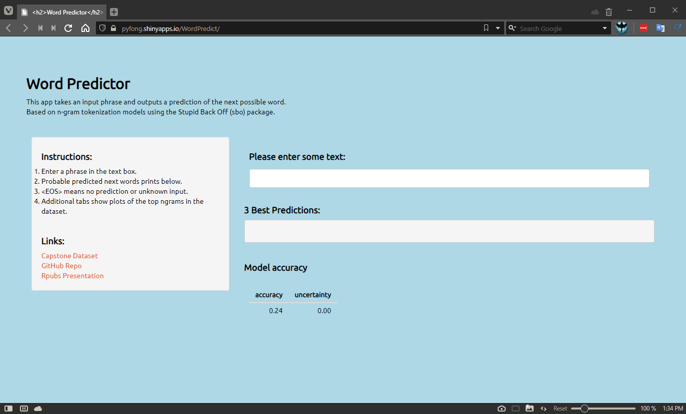

```{r setup, include=FALSE}
library (knitr)
library (here)
library (kableExtra)
opts_chunk$set(cache.lazy= T,
               echo = T,
               message=F,
               warning=F,
               comment="")
```

##  1.0 What is the Word Predictor?
###   The 2021 Word Predictor;  

  - is a prototype NLP app used to predict the next word on a preceding input.
  - uses the en_US capstone data set containing a corpus of text from blogs, news and twitter.
  - allows the user to key in phrases to predict a set of 3 choices for the next word.
  - was built in R using the SBO package based on N-gram tokenization models.
  
Link: [Capstone Dataset](https://d396qusza40orc.cloudfront.net/dsscapstone/dataset/Coursera-SwiftKey.zip)

##  2.0 App Structure
The app was built with the following scripts:

1.  Data loading, preparation and cleaning.
    *(data_prepare_predict_01.R)*
2.  Model creation.  
    *(sbo.prediction_01.R)*
3.  Testing and evaluation.  
    *(sbo.prediction_01.R)*
4.  Shiny App creation and packaging.  
    *(/Shiny/)*

Link: [Code @ GitHub](http://github.com/pyfong1579/Coursera-Data-Science-Specialization_Course-10_Data-Science-Capstone)

##  3.0 App Availabilty
Prototype Link: [Shiny App](http://pyfong.shinyapps.io/WordPredict/)

```{r prototype, echo=FALSE, fig.cap="Screenshot", out.width = '90%'}

```

##  4.0 Discussion
<div class="columns-2">
### 4.1 Key parameters.
Due to computing resource limitations:

* only 10% of the total corpus from en_US was used.
* a split of 80-20 was used for training and validation data sets.
* a maximum of 6-grams in the prediction model.
* a maximum of 3 options were returned from the model.\
\
\
Other Links: [Week 2 Milestone Report](http://rpubs.com/pyfong/720438)

### 4.2 Accuracy & Uncertainty
```{r Table, echo= F}
load(here("Outputs", "accuracy"))
kbl(acc, digits= 5, format.args = list(scientific = F)) %>%
  kable_minimal(full_width = F, position = "center")
```
### 4.3 Improvements required
To improve the accuracy of the app:

* Increase computing resources.
* Use the entire en_US corpus.
* Use a higher N-gram.   
</div>